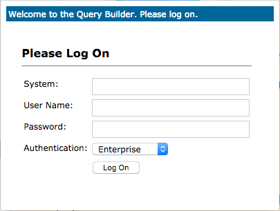

= BusinessObjects Enterprise Query Builder
:author: Craig Buchanan
:description: BusinessObjects Enterprise Query Builder
:email: craig.buchanan@cogniza.com
:revision: 0.0.1
// :icons:
:toc:
:toclevels: 4
:toc-placement: left
// :numbered:
// :sectnumlevels: 2
// embed CSS and images in document
:data-uri:
// :source-highlighter: coderay
// enable UI macros
:experimental:
// :theme: flask
// :doctype: book
:revdate: {docdate} {doctime}

== Introduction
Use BusinessObjects Enterprise's Query Builder to rapidly find information about items in the repository.

== Instructions

* Navigate to the Query Builder (http://<server_name>:6405/AdminTools/)

* Supply credentials; click kbd:[Log On]:

* Enter query into text box; click kbd:[Submit Query]:

* Results

== Sample Queries

Use these queries in the Query Builder to answer specific questions.

NOTE: The queries are caSE insENSitive.

=== General

==== Objects contained in a folder

[source,sql]
----
SELECT	si_id, si_name, si_kind
FROM	ci_ifnoobjects, ci_appobjects, ci_systemobjects
WHERE	Children("si_name='Folder Hierarchy'","si_name='<folder name>'")
----

=== Web Intelligence / Universe

==== All Universes

[source,sql]
----
SELECT	si_id, si_name, si_description, si_kind, si_creation_time, si_update_ts
FROM	ci_appobjects,ci_INFOobjects
WHERE	si_kind IN ('Universe','DSL.MetaDataFile')
ORDER BY	si_name
----

==== Web-Intelligence reports that reference a UDT/UNV Universe

[source,sql]
----
SELECT	si_id, si_name, si_kind
FROM	ci_ifnoobjects, ci_appobjects
WHERE	si_kind='WebI'
AND	Parents("si_name='Webi-Universe'","si_name='<universe name>'")
----

==== Web-Intelligence reports that reference an IDT/UNX Universe

[source,sql]
----
SELECT	si_id, si_name, si_kind
FROM	ci_ifnoobjects, ci_appobjects
WHERE	si_kind='WebI'
AND	Parents("si_name='Document-DSL.Universe'","si_name='<universe name>.unx'")
----

=== User and Group

==== User information

[source,sql]
----
SELECT	si_id, si_name, si_userfullname, si_email_address, si_alias
FROM	ci_systemobjects
WHERE	si_name='<user name>'
----

==== Groups assigned to a User

[source,sql]
----
SELECT	*
FROM	ci_systemobjects
WHERE	Parents("si_name='UserGroup-User'", "si_name='<user name>'")
----

==== Users assigned to a Group

[source,sql]
----
SELECT	*
FROM	ci_systemobjects
WHERE	Children("si_name='UserGroup-User'", "si_name='<group name>'")
----

== Revision History
[width="100%",cols="",options="header"]
|===
|Version|Date|Comments
|0.0.1|29-MAR-2017|Adding additional query samples; correcting queries
|0.0.0|28-MAR-2017|Initial release
|===
